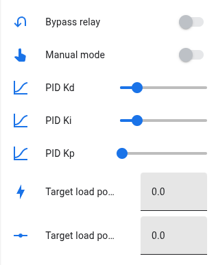
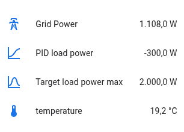

[](https://github.com/x-real-ip/zero-grid/actions/workflows/auto-release.yaml)

# zero-grid

Routes surplus solar power to a heating element using an ESP32. The goal: **keep
grid power near 0 W** by dynamically adjusting heater load based on live grid
readings.

> [!CAUTION]
> This project involves high-voltage AC and electronic circuits. You must have knowledge of electronics and safe handling of mains> electricity. Improper use can cause serious injury, death, or property damage. I am not responsible for any damage, injury, or accidents resulting from the use of this project. Proceed at your own risk.

- [zero-grid](#zero-grid)
  - [Features](#features)
  - [How it works](#how-it-works)
    - [Deeper Explanation](#deeper-explanation)
      - [Example of real-time control](#example-of-real-time-control)
      - [Why use PID control?](#why-use-pid-control)
      - [What the DAC and voltage regulator actually do](#what-the-dac-and-voltage-regulator-actually-do)
      - [Why the bypass relay exists](#why-the-bypass-relay-exists)
  - [PID Control](#pid-control)
    - [Adjusting the PID Controller in Home Assistant](#adjusting-the-pid-controller-in-home-assistant)
      - [Where to find the sliders](#where-to-find-the-sliders)
      - [How to tune the PID](#how-to-tune-the-pid)
      - [Tuning procedure](#tuning-procedure)
        - [Start with only **Kp**](#start-with-only-kp)
        - [Add **Ki** to remove steady-state error](#add-ki-to-remove-steady-state-error)
        - [Add **Kd** (optional)](#add-kd-optional)
      - [Live Monitoring](#live-monitoring)
      - [Goal](#goal)
  - [Hardware](#hardware)
  - [MQTT Topics](#mqtt-topics)
  - [ESPHome Configuration](#esphome-configuration)
  - [Downsides and Considerations](#downsides-and-considerations)
    - [Harmonics](#harmonics)
  - [Installing](#installing)
    - [1. Prepare the Files](#1-prepare-the-files)
    - [2. Add the Project to ESPHome Dashboard](#2-add-the-project-to-esphome-dashboard)
    - [3. Build and Flash the Firmware](#3-build-and-flash-the-firmware)
    - [4. Initial Setup in Home Assistant](#4-initial-setup-in-home-assistant)

This project is based on ESPHome and **fully integrated with Home Assistant**




---

## Features

- **PID-controlled power routing** - keeps grid export/import balanced around 0
  W
- **DAC output (0–10 V)** - controls an external voltage regulator for heater
  power
- **Bypass relay (GPIO 33)** - enables full-power mode when solar output exceeds
  the heater capacity
- **Automatic operation** - reacts to grid power changes several times per
  second
- **Manual mode** - allows manual control for testing or calibration
- **MQTT integration** - receives power and voltage data from a smart meter or
  Home Assistant
- **Debug logging** - shows PID loop behavior and DAC output in real time

---

## How it works

1. **Grid power** is measured via MQTT (delivered - returned).
2. The **PID controller** adjusts the **target load power** so that grid power →
   0 W.
3. The **DAC output** generates a voltage (0–10 V) proportional to desired
   heater power.
4. The external **voltage regulator** translates that DAC signal to an AC output
   for the heater.
5. If surplus ≥ heater max power, the **bypass relay** closes, sending full
   power to the load.

### Deeper Explanation

The system acts as a **dynamic power balancer** between your solar panels, the
grid, and your heating load. Instead of simply turning a heater on or off, the
controller continuously measures how much power is being imported from or
exported to the grid. It then adjusts the heater power (like a dimmer) so that
the net flow becomes **as close to zero as possible**.

This approach ensures:

- Maximum use of **surplus solar energy**
- Minimal or zero **grid export**
- Minimal **grid import**, unless solar power drops
- Smooth, stable adjustment of heater load (no flicker, no rapid switching)

#### Example of real-time control

- Your panels are producing **1000 W** more than your home is using.  
  → The controller increases heater power toward 1000 W.

- Clouds pass and production suddenly drops by 500 W.  
  → The PID controller reacts within milliseconds and reduces heater power.

- You turn on a 2000 W appliance.  
  → The controller sees grid import and quickly lowers heater power to
  compensate.

This continuous feedback loop keeps your household consumption balanced without
manual intervention.

#### Why use PID control?

A simple on/off switch would cause:

- Huge oscillations
- Audible relay clicking
- Inefficient use of solar power
- Sudden changes in grid import/export

A PID controller solves this by applying _proportional_, _integral_, and
_derivative_ corrections, resulting in:

- Fast response
- Minimal overshoot
- Stable, smooth power adjustment
- Better tracking of fluctuating solar production

#### What the DAC and voltage regulator actually do

The ESP32 cannot directly control or switch mains voltage.  
Instead, it uses a **high-resolution 15-bit DAC (0–10 V output)** to tell the
**external voltage regulator** how much power the heater should receive.

How it works:

- The **DAC outputs a safe, low-voltage control signal (0–10 V)** with **15-bit
  resolution**, allowing very fine-grained control over heater power
- The **voltage regulator reads this signal** and adjusts how much AC power it
  delivers to the heater
- Only the **voltage regulator is connected to mains voltage**, not the ESP32
- The heater receives more or less power depending on the DAC voltage

This allows the ESP32 to **smoothly modulate heater power** without ever
touching AC lines directly, making the system much safer and compatible with
industrial “0–10 V control” dimmers and regulators.

#### Why the bypass relay exists

When solar production **exceeds the maximum adjustable heater power**, the
DAC-controlled regulator cannot use the surplus completely. In these cases:

- The bypass relay turns on
- The heater runs at **full power**
- The controller still stabilizes the remaining surplus using the PID loop

This ensures **all available solar energy is used** without wasting it back to
the grid.

---

---

## PID Control

| Term   | Function          | Tuning tip                                             |
| ------ | ----------------- | ------------------------------------------------------ |
| **Kp** | Proportional gain | Increase to make response faster, but risk oscillation |
| **Ki** | Integral gain     | Compensates long-term offset; too high → overshoot     |
| **Kd** | Derivative gain   | Dampens fast changes; helps stabilize                  |

**Target behavior:**

> If grid power is **negative** (exporting), increase the load.  
> If grid power is **positive** (importing), decrease the load.

all PID parameters (**Kp**, **Ki**, **Kd**) can be **adjusted live** from within
Home Assistant using sliders. This allows you to fine-tune the control behavior
in real time while monitoring power flow and system response.

### Adjusting the PID Controller in Home Assistant

All PID parameters are exposed as **number entities** in Home Assistant, so you
can tune the control loop **live** without reflashing the ESP32.

#### Where to find the sliders

Once the device is added to Home Assistant, navigate to:

**Settings → Devices & Services → zero-grid → Controls**

You will see three adjustable sliders:

- **PID Kp** – proportional gain
- **PID Ki** – integral gain
- **PID Kd** – derivative gain

Adjusting these values updates the ESP32 **instantly**.

#### How to tune the PID

Start with these recommended baseline values:

| Parameter | Start value | Effect                         |
| --------- | ----------- | ------------------------------ |
| **Kp**    | 0.50        | Main “strength” of response    |
| **Ki**    | 0.10        | Corrects long-term drift       |
| **Kd**    | 0.00        | Dampens oscillation (optional) |

#### Tuning procedure

##### Start with only **Kp**

- Increase **Kp** until the system reacts quickly.
- If power starts oscillating → reduce **Kp** slightly.

##### Add **Ki** to remove steady-state error

- Increase **Ki** slowly until the controller keeps grid power near 0 W.
- Too high **Ki** causes overshoot, oscillation, and instability.

##### Add **Kd** (optional)

- Use **Kd** to reduce oscillations during rapid solar changes.
- Too high **Kd** makes the system slow or unresponsive.

#### Live Monitoring

In Home Assistant you can graph:

- Grid power
- Target load power
- PID output
- Heater voltage

This allows **real-time feedback** while adjusting the parameters.

#### Goal

> Keep grid power as close to **0 W** as possible  
> while smoothly adjusting heater load **without oscillation**.

---

## Hardware

| Component             | Description               | Notes                                       |
| --------------------- | ------------------------- | ------------------------------------------- |
| **ESP32**             | Main controller           | Any ESP32 dev board                         |
| **DAC (I²C)**         | 15-bit DAC, 0–10 V output | Controlling the voltage regulator           |
| **Voltage regulator** | Accepts 0–10 V control    | Drives the heater                           |
| **Heater load**       | Resistive element         | e.g. 2000 W @ 230 V                         |
| **Bypass relay**      | GPIO 33                   | Engages full power when surplus ≥ max power |

---

## MQTT Topics

| Topic example                                  | Description                 | Value example |
| ---------------------------------------------- | --------------------------- | ------------- |
| `dsmr/reading/electricity_currently_delivered` | Power drawn from grid (kW)  | `0.300`       |
| `dsmr/reading/electricity_currently_returned`  | Power exported to grid (kW) | `0.600`       |
| `dsmr/reading/phase_voltage_l1`                | Grid voltage (V)            | `230.0`       |

---

## ESPHome Configuration

Main config (where the action take place):

```yaml
esphome:
  name: solar-router
  includes:
    - solar-router.h

interval:
  - interval: 200ms
    then:
      - lambda: |-
          id(pid_load_power) = pid_target_load_power(
              id(grid_power),
              id(pid_load_power),
              id(target_load_power_max),
              id(pid_Kp).state,
              id(pid_Ki).state,
              id(pid_Kd).state,
              id(pid_dt),
              id(pid_integral),
              id(pid_error_prev)
          );

          route_power_to_load(
            id(i2cbus),
            id(dac_addr_reg),
            id(pid_load_power),
            id(target_load_power_max),
            id(load_resistance),
            id(grid_voltage).state
          );
```

## Downsides and Considerations

While this Zero-Grid system is highly effective for routing surplus solar power,
there are a few important limitations and considerations:

### Harmonics

- When the voltage regulator **dims a resistive heater**, it does not provide a
  perfectly smooth AC waveform.
- This modulation can create **electrical harmonics** on your mains supply.
- These harmonics can:
  - Slightly distort the voltage waveform
  - Potentially interfere with sensitive electronics
  - Increase heating in wires or transformers in extreme cases
  - **Cause audible buzzing or humming** from the heater, wiring, or voltage
    regulator  
    (common with phase-angle or waveform-modulated dimming)

The buzzing sound becomes more noticeable at **partial load levels**, where the
waveform is most distorted.

Read more about harmonics here:
https://en.wikipedia.org/wiki/Harmonics_(electrical_power)

## Installing

Installing using Zero-Grid via ESPHome Dashboard

Because the firmware contains **personal secrets** (Wi-Fi, MQTT, OTA), users
must **build the firmware locally** using their own credentials. Prebuilt `.bin`
files cannot be used directly.

The next steps explains how to safely install Zero-Grid.

### 1. Prepare the Files

1. Clone or download the repository:

```bash
git clone https://github.com/x-real-ip/zero-grid.git
cd zero-grid/esphome
```

2. Ensure the following files are in your ESPHome project folder:

- zero-grid.yaml
- zero-grid.h
- secrets.yaml

Create a personal secrets.yaml file with your credentials:

```yaml
wifi_ssid: "YOUR_WIFI_SSID"
wifi_password: "YOUR_WIFI_PASSWORD"
mqtt_user: "YOUR_MQTT_USER"
mqtt_password: "YOUR_MQTT_PASSWORD"
ota_password: "YOUR_OTA_PASSWORD"
api_encryption_key: "YOUR_API_KEY"
```
> [!IMPORTANT]
> Never commit your secrets.yaml to a public repository.

### 2. Add the Project to ESPHome Dashboard

1. Open ESPHome Dashboard in your browser.  
2. Click + NEW DEVICE → Manual upload or Create custom configuration.  
3. Name your device (e.g., zero-grid).  
4. Click Add YAML file and select your zero-grid.yaml.  
5. Make sure zero-grid.h is in the same folder so ESPHome can include it automatically.

### 3. Build and Flash the Firmware

1. In ESPHome Dashboard, click Install for your device.

2. Choose a flashing method:
    - Plug in via USB → recommended for first flash
    - OTA → only if the device already has ESPHome firmware running

3. ESPHome will build the firmware using your personal secrets.yaml and flash it to the ESP32.

### 4. Initial Setup in Home Assistant

 - After flashing the device will connect to your Wi-Fi and MQTT broker and you can add it to your Home Assistant instance.
