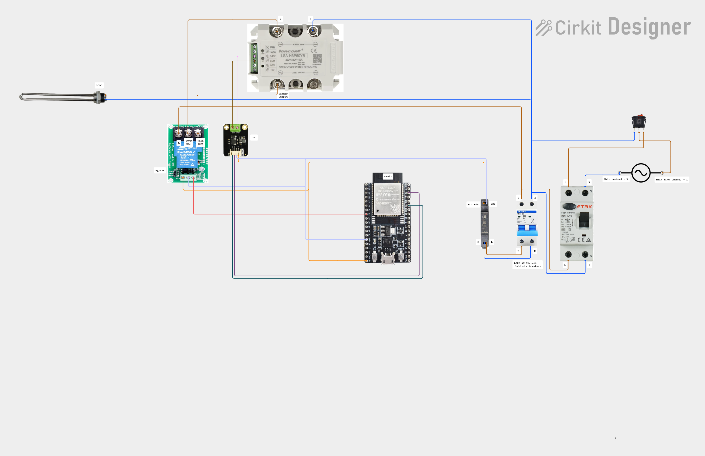

[](https://github.com/x-real-ip/zero-grid/actions/workflows/auto-release.yaml)

# zero-grid

Routes surplus solar power to a heating element using an ESP32. The goal: **keep
grid power near 0 W** by dynamically adjusting heater load based on live grid
readings.

> [!CAUTION]
> This project involves high-voltage AC and electronic circuits. You
> must have knowledge of electronics and safe handling of mains electricity.
> Improper use can cause serious injury, death, or property damage. I am not
> responsible for any damage, injury, or accidents resulting from the use of
> this project. Proceed at your own risk.

- [zero-grid](#zero-grid)
  - [Motivation / Background](#motivation--background)
  - [Features](#features)
  - [How it works](#how-it-works)
    - [Deeper Explanation](#deeper-explanation)
      - [Example of real-time control](#example-of-real-time-control)
      - [Why use PID control?](#why-use-pid-control)
      - [What the DAC and voltage regulator actually do](#what-the-dac-and-voltage-regulator-actually-do)
      - [Why the bypass relay exists](#why-the-bypass-relay-exists)
  - [Home Assistant Entities](#home-assistant-entities)
    - [Power \& Sensor Entities](#power--sensor-entities)
    - [Control Entities](#control-entities)
    - [PID Tuning Entities](#pid-tuning-entities)
    - [Target Load Power Entities](#target-load-power-entities)
    - [Diagnostic Entities](#diagnostic-entities)
  - [PID Control](#pid-control)
    - [Adjusting the PID Controller in Home Assistant](#adjusting-the-pid-controller-in-home-assistant)
      - [Where to find the sliders](#where-to-find-the-sliders)
      - [How to tune the PID](#how-to-tune-the-pid)
      - [Tuning procedure](#tuning-procedure)
        - [Start with only **Kp**](#start-with-only-kp)
        - [Add **Ki** to remove steady-state error](#add-ki-to-remove-steady-state-error)
        - [Add **Kd** (optional)](#add-kd-optional)
      - [Anti-Windup](#anti-windup)
        - [Lower Limit: **–300**](#lower-limit-300)
        - [Upper Limit: **+3000**](#upper-limit-3000)
      - [Live Monitoring](#live-monitoring)
      - [Goal](#goal)
  - [Hardware](#hardware)
    - [Pinout](#pinout)
    - [Wiring](#wiring)
      - [With Bypass](#with-bypass)
  - [Determining the Resistance](#determining-the-resistance)
    - [Method 1 - Measure With a Multimeter (Most Accurate)](#method-1---measure-with-a-multimeter-most-accurate)
    - [Method 2 - Calculate Resistance From Heater Label](#method-2---calculate-resistance-from-heater-label)
    - [Reference Table](#reference-table)
  - [MQTT Topics](#mqtt-topics)
  - [ESPHome Configuration](#esphome-configuration)
  - [Downsides and Considerations](#downsides-and-considerations)
    - [Harmonics](#harmonics)
  - [Installing](#installing)
    - [1. Prepare the Files](#1-prepare-the-files)
    - [2. Add the Project to ESPHome Dashboard](#2-add-the-project-to-esphome-dashboard)
    - [3. Build and Flash the Firmware](#3-build-and-flash-the-firmware)
    - [4. Initial Setup in Home Assistant](#4-initial-setup-in-home-assistant)

This project is based on ESPHome and **fully integrated with Home Assistant**


## Motivation / Background

In the **Netherlands**, the **net metering scheme (“salderingsregeling”)**
currently allows solar panel owners to offset their electricity consumption with
self-generated solar power.

However, this scheme will **end on January 1, 2027**:

- Solar owners will **no longer be able to fully offset their electricity
  usage** with self-generated power.
- They will receive a **small compensation** for feeding excess electricity back
  to the grid.

As a result, it becomes increasingly important to **use solar energy locally**
instead of exporting it.

The **Zero-Grid project was created to address this challenge**: it dynamically
routes surplus solar power to a heater or other resistive loads, **keeping grid
import/export near zero** and maximizing self-consumption.

---

## Features

- **PID-controlled power routing** - keeps grid export/import balanced around 0
  W
- **DAC output (0–10 V)** - controls an external voltage regulator for heater
  power
- **Bypass relay (GPIO 33)** - enables full-power mode when solar output exceeds
  the heater capacity
- **Automatic operation** - reacts to grid power changes several times per
  second
- **Manual mode** - allows manual control for testing or calibration
- **MQTT integration** - receives power and voltage data from a smart meter or
  Home Assistant
- **Debug logging** - shows PID loop behavior and DAC output in real time

---

## How it works

1. **Grid power** is measured via MQTT (delivered - returned).
2. The **PID controller** adjusts the **target load power** so that grid power →
   0 W.
3. The **DAC output** generates a voltage (0–10 V) proportional to desired
   heater power.
4. The external **voltage regulator** translates that DAC signal to an AC output
   for the heater.
5. If surplus ≥ heater max power, the **bypass relay** closes, sending full
   power to the load.

### Deeper Explanation

The system acts as a **dynamic power balancer** between your solar panels, the
grid, and your heating load. Instead of simply turning a heater on or off, the
controller continuously measures how much power is being imported from or
exported to the grid. It then adjusts the heater power (like a dimmer) so that
the net flow becomes **as close to zero as possible**.

This approach ensures:

- Maximum use of **surplus solar energy**
- Minimal or zero **grid export**
- Minimal **grid import**, unless solar power drops
- Smooth, stable adjustment of heater load (no flicker, no rapid switching)

#### Example of real-time control

- Your panels are producing **1000 W** more than your home is using.  
  → The controller increases heater power toward 1000 W.

- Clouds pass and production suddenly drops by 500 W.  
  → The PID controller reacts within milliseconds and reduces heater power.

- You turn on a 2000 W appliance.  
  → The controller sees grid import and quickly lowers heater power to
  compensate.

This continuous feedback loop keeps your household consumption balanced without
manual intervention.

#### Why use PID control?

A simple on/off switch would cause:

- Huge oscillations
- Audible relay clicking
- Inefficient use of solar power
- Sudden changes in grid import/export

A PID controller solves this by applying _proportional_, _integral_, and
_derivative_ corrections, resulting in:

- Fast response
- Minimal overshoot
- Stable, smooth power adjustment
- Better tracking of fluctuating solar production

#### What the DAC and voltage regulator actually do

The ESP32 cannot directly control or switch mains voltage.  
Instead, it uses a **high-resolution 15-bit DAC (0–10 V output)** to tell the
**external voltage regulator** how much power the heater should receive.

How it works:

- The **DAC outputs a safe, low-voltage control signal (0–10 V)** with **15-bit
  resolution**, allowing very fine-grained control over heater power
- The **voltage regulator reads this signal** and adjusts how much AC power it
  delivers to the heater
- Only the **voltage regulator is connected to mains voltage**, not the ESP32
- The heater receives more or less power depending on the DAC voltage

This allows the ESP32 to **smoothly modulate heater power** without ever
touching AC lines directly, making the system much safer and compatible with
industrial “0–10 V control” dimmers and regulators.

#### Why the bypass relay exists

The bypass relay is included because running the voltage regulator at **100%
output is pointless**.  
At full duty the regulator no longer regulates-it simply acts as a resistive,
lossy device in the power path.

To avoid unnecessary heat, losses, and inefficiency:

- When the PID output requests **full power**, the bypass relay engages.
- The heater is then connected **directly to mains**, skipping the voltage
  regulator entirely.
- This gives the same 100% heater power, but **without forcing the regulator to
  operate at its inefficient limit**.
- For all partial-power situations, the regulator + DAC combination takes over
  again.

The relay ensures that the system uses the regulator **only when modulation is
needed** and bypasses it whenever the heater should run at full power.

---

## Home Assistant Entities

This project integrates tightly with Home Assistant.  
All important measurements, controls, and tuning parameters are exposed as
entities so you can monitor the system and adjust behavior _without reflashing
the ESP32_.

Below is an overview of all entities and what they are used for.

### Power & Sensor Entities

| Entity                                | Type        | Purpose                                                                                                                               |
| ------------------------------------- | ----------- | ------------------------------------------------------------------------------------------------------------------------------------- |
| `sensor.solar_router_grid_power`      | Sensor (W)  | Real-time grid import/export. Positive = consumption, negative = export. This is the primary PID input.                               |
| `sensor.solar_router_pid_load_power`  | Sensor (W)  | The PID output calculated power currently being sent to the heater.                                                                   |
| `sensor.routed_load_power_calculated` | Sensor (W)  | Estimated real power currently routed to the load. Calculated using grid voltage, load resistance, and DAC output.                    |
| `sensor.solar_router_temperature`     | Sensor (°C) | Measures temperature via the DS18B20 sensor. Can be used to monitor heater, water, or ambient temperature for diagnostics or logging. |

### Control Entities

| Entity                             | Type   | Purpose                                                                                                                                                                                 |
| ---------------------------------- | ------ | --------------------------------------------------------------------------------------------------------------------------------------------------------------------------------------- |
| `switch.zero_grid_bypass_relay`    | Switch | Manually activates the bypass relay (normally automatic). Useful for testing or to turn on the heater even if you don't produce solar power.                                            |
| `switch.zero_grid_manual_mode`     | Switch | Enables or disables manual mode. When **ON**, you can manually set the heater load using `number.target_load_power_manual`. When **OFF**, the PID loop controls the load automatically. |
| `switch.zero_grid_routing_enabled` | Switch | Enables or disables routing to the heater entirely.                                                                                                                                     |

### PID Tuning Entities

| Entity                    | Type   | Purpose                                                 |
| ------------------------- | ------ | ------------------------------------------------------- |
| `number.zero_grid_pid_Kp` | Number | Proportional gain - reacts to changes in grid power.    |
| `number.zero_grid_pid_Ki` | Number | Integral gain - corrects steady-state errors over time. |
| `number.zero_grid_pid_Kd` | Number | Derivative gain - dampens rapid changes in grid power.  |

### Target Load Power Entities

| Entity                                             | Type   | Purpose                                                                                                                                                                                                                                                                                                                |
| -------------------------------------------------- | ------ | ---------------------------------------------------------------------------------------------------------------------------------------------------------------------------------------------------------------------------------------------------------------------------------------------------------------------- |
| `number.zero_grid_target_load_power_manual`        | Number | Sets the **target heater power manually**. When **Manual Mode** is active, the controller will route this exact power to the load, bypassing the PID automatic control. Useful for testing or calibration.                                                                                                             |
| `number.zero_grid_target_load_power_max`           | Number | Defines the **maximum allowed heater power** for automatic control. The PID loop will never exceed this value when adjusting the load. Also used to determine when the **bypass relay** should engage if solar surplus exceeds this maximum.                                                                           |
| `number.zero_grid_target_load_resistance_setpoint` | Number | Sets the **heater resistance value (in ohms)** used for power calculations. This allows the system to accurately convert PID output (requested power) into the correct DAC duty cycle based on your heater’s actual resistance. Adjust this if you change for your heating element or want more precise power control. |

### Diagnostic Entities

| Entity                           | Type          | Purpose                                                        |
| -------------------------------- | ------------- | -------------------------------------------------------------- |
| `binary_sensor.zero_grid_status` | Binary Sensor | ESP32 online status - "Verbonden" means connected.             |
| `sensor.zero_grid_uptime`        | Sensor        | Shows how long the ESP32 has been running (e.g., `189.432 s`). |
| `sensor.zero_grid_version`       | Sensor        | Firmware version and build timestamp.                          |
| `sensor.zero_grid_wifi_signal`   | Sensor        | Wi-Fi signal strength in dBm.                                  |
| `sensor.zero_grid_wifi_ssid`     | Sensor        | Connected Wi-Fi SSID.                                          |
| `sensor.zero_grid_wifi_bssid`    | Sensor        | Wi-Fi access point BSSID.                                      |
| `sensor.zero_grid_wifi_ip`       | Sensor        | ESP32 current IP address.                                      |

---

## PID Control

| Term   | Function          | Tuning tip                                             |
| ------ | ----------------- | ------------------------------------------------------ |
| **Kp** | Proportional gain | Increase to make response faster, but risk oscillation |
| **Ki** | Integral gain     | Compensates long-term offset; too high → overshoot     |
| **Kd** | Derivative gain   | Dampens fast changes; helps stabilize                  |

**Target behavior:**

> If grid power is **negative** (exporting), increase the load.  
> If grid power is **positive** (importing), decrease the load.

all PID parameters (**Kp**, **Ki**, **Kd**) can be **adjusted live** from within
Home Assistant using sliders. This allows you to fine-tune the control behavior
in real time while monitoring power flow and system response.

### Adjusting the PID Controller in Home Assistant

All PID parameters are exposed as **number entities** in Home Assistant, so you
can tune the control loop **live** without reflashing the ESP32.

#### Where to find the sliders

Once the device is added to Home Assistant, navigate to:

**Settings → Devices & Services → zero-grid → Controls**

You will see three adjustable sliders:

- **PID Kp** – proportional gain
- **PID Ki** – integral gain
- **PID Kd** – derivative gain

Adjusting these values updates the ESP32 **instantly**.

#### How to tune the PID

Start with these recommended baseline values:

| Parameter | Start value | Effect                         |
| --------- | ----------- | ------------------------------ |
| **Kp**    | 0.50        | Main “strength” of response    |
| **Ki**    | 0.10        | Corrects long-term drift       |
| **Kd**    | 0.00        | Dampens oscillation (optional) |

#### Tuning procedure

##### Start with only **Kp**

- Increase **Kp** until the system reacts quickly.
- If power starts oscillating → reduce **Kp** slightly.

##### Add **Ki** to remove steady-state error

- Increase **Ki** slowly until the controller keeps grid power near 0 W.
- Too high **Ki** causes overshoot, oscillation, and instability.

##### Add **Kd** (optional)

- Use **Kd** to reduce oscillations during rapid solar changes.
- Too high **Kd** makes the system slow or unresponsive.

#### Anti-Windup

The PID controller includes an **anti-windup mechanism** to keep the system
stable and prevent overshoot.  
Windup occurs when the **integral term** keeps accumulating error even when the
heater output is already at its limit.  
This can cause:

- large overshoots
- slow recovery
- oscillations in grid import/export
- unstable or noisy heater output

To prevent this, the integral value is **clamped** between **–300** and
**+3000**.

##### Lower Limit: **–300**

A negative integral is important when the system temporarily overshoots (grid
import).  
Allowing the integral to go slightly negative:

- speeds up correction
- prevents sluggish response
- reduces oscillation

The limit of **–300** provides enough negative authority without making the
system unstable.

##### Upper Limit: **+3000**

During strong solar production the heater may run at full power.  
Without an upper bound, the integral would continue growing, causing:

- slow reaction when surplus drops
- grid import spikes
- oscillation around 0 W

The **+3000** limit prevents excessive integral buildup while keeping the
controller responsive and smooth.

#### Live Monitoring

In Home Assistant you can graph:

- Grid power
- Target load power
- PID output
- Heater voltage

This allows **real-time feedback** while adjusting the parameters.

#### Goal

> Keep grid power as close to **0 W** as possible  
> while smoothly adjusting heater load **without oscillation**.

---

## Hardware

| Component                                                                                                                                                                        | Description                    | Notes                                                    | Required |
| -------------------------------------------------------------------------------------------------------------------------------------------------------------------------------- | ------------------------------ | -------------------------------------------------------- | -------- |
| [ESP32 Dev Board](https://www.espressif.com/en/products/devkits/esp32-devkitc)                                                                                                   | Main controller                | Any ESP32 dev board                                      | Yes      |
| [DFRobot Gravity GP8211 DAC (I²C)](https://www.dfrobot.com/product-2757.html)                                                                                                    | 15-bit DAC Module (0–5V/0–10V) | Controls the voltage regulator                           | Yes      |
| [LSA-H3P50YB AC Voltage Regulator](https://nl.aliexpress.com/item/32606780994.html?spm=a2g0o.order_list.order_list_main.126.1fab1802njlUdD&gatewayAdapt=glo2nld)                 | Single-phase AC 50A, 220V/380V | Accepts 0–10 V control and drives the heater             | Yes      |
| [Resistive Heater](https://www.amazon.com/s?k=2000w+resistive+heater)                                                                                                            | Resistive load                 | e.g., 2000 W @ 230 V                                     | Yes      |
| [1-Channel 30A Relay Module with Optocoupler](https://nl.aliexpress.com/item/1005005870389973.html?spm=a2g0o.order_list.order_list_main.114.1fab1802njlUdD&gatewayAdapt=glo2nld) | Bypass relay                   | Engages full power when surplus ≥ max power              | No       |
| [KCD3 Rocker Switch](https://nl.aliexpress.com/item/4000847897284.html?spm=a2g0o.order_list.order_list_main.17.677779d20KnYlF&gatewayAdapt=glo2nld)                              | On/Off switch                  | Manual control for testing or bypass                     | No       |
| [Project Box / Enclosure](https://nl.aliexpress.com/item/1005009144913907.html?spm=a2g0o.order_list.order_list_main.45.130a1802Ag3rko&gatewayAdapt=glo2nld)                      | Enclosure for electronics      | Choose appropriate size for your components              | No       |
| [DS18B20 Temperature Sensor](https://nl.aliexpress.com/item/1005008071825088.html?spm=a2g0o.order_list.order_list_main.62.1fab1802njlUdD&gatewayAdapt=glo2nld)                   | Temperature measurement        | Monitor heat in the Project Box / Enclosure              | No       |
| [PCB DIN 35 Rail Mounting Adapter](https://nl.aliexpress.com/item/1005006226938330.html?spm=a2g0o.order_list.order_list_main.74.1fab1802njlUdD&gatewayAdapt=glo2nld)             | Mount the DAC or other modules | Fits standard DIN rail                                   | No       |
| [Universal Wiring Cable Connectors](https://nl.aliexpress.com/item/1005007267097360.html?spm=a2g0o.order_list.order_list_main.91.1fab1802njlUdD&gatewayAdapt=glo2nld)            | Electrical connections         | For safe wiring of modules                               | No       |
| [AC Power Socket (Output)](https://nl.aliexpress.com/item/32946228553.html?spm=a2g0o.order_list.order_list_main.97.1fab1802njlUdD&gatewayAdapt=glo2nld)                          | Output powersocket             | Connect your heater                                      | No       |
| [Voltage Regulator Heat Sink](https://nl.aliexpress.com/item/1005009155430670.html?spm=a2g0o.order_list.order_list_main.108.1fab1802njlUdD&gatewayAdapt=glo2nld)                 | Cooling                        | Required for heat dissipation of the AC regulator        | No       |
| [1-Channel 30A Relay Module with Optocoupler](https://nl.aliexpress.com/item/1005005870389973.html?spm=a2g0o.order_list.order_list_main.114.1fab1802njlUdD&gatewayAdapt=glo2nld) | Optional relay                 | Engages full power when surplus ≥ max power              | No       |
| [C14 Inlet Power Socket](#)                                                                                                                                                      | Input powersocket              | Pay attention, this one is max 2500 watt (250 VAC, 10 A) | No       |
| [DIN Rail](https://nl.aliexpress.com/item/1005005467003334.html?spm=a2g0o.order_list.order_list_main.51.18751802YkthVQ&gatewayAdapt=glo2nld)                                     | Mounting rail                  | Standard 35 mm DIN                                       | No       |
| [DIN Rail Power Supply 5V](https://www.tinytronics.nl/en/power/power-supplies/5v/yingjiao-din-rail-power-supply-5v-2.4a)                                                         | 5V Power Supply                | Provides stable power to ESP32, DAC, and sensors         | No       |
| [Circuit Breaker](https://www.amazon.com/UL-489-Miniature-Circuit-Breaker-Non-Polarized/dp/B0FBWFCLNT/ref=sr_1_2?sr=8-2)                                                         | 13A/16A                        | Choose based on maximum heater load                      | No       |

### Pinout

| Pin     | Component / Function                | Description                                                           |
| ------- | ----------------------------------- | --------------------------------------------------------------------- |
| GPIO 4  | DS18B20 Temperature Sensor (1-Wire) | Measures temperature (optional, for monitoring heater or environment) |
| GPIO 21 | I²C SDA                             | Data line for I²C bus (DAC communication)                             |
| GPIO 22 | I²C SCL                             | Clock line for I²C bus (DAC communication)                            |
| GPIO 33 | Bypass Relay                        | Engages full heater power when solar surplus exceeds max load         |

### Wiring

#### With Bypass


https://app.cirkitdesigner.com/project/aa80dcf3-7fce-44a5-bc96-f0a5bf95a78f

---

## Determining the Resistance

To accurately calculate how much power your heater can consume at different DAC
output levels, the system must know the **electrical resistance (Ω)** of your
heating element.

There are **two ways** to determine this value.

### Method 1 - Measure With a Multimeter (Most Accurate)

> [!WARNING]
> Always disconnect the heater from mains power before performing measurements.

**Steps:**

1. Unplug the heater completely.
2. Set your multimeter to **Ω (resistance)** mode.
3. Touch the probes to the two plug terminals:
   - Probe 1 → pin 1
   - Probe 2 → pin 2
4. Read the resistance value (typically **20–60 Ω** for 1000–3000 W heaters).

### Method 2 - Calculate Resistance From Heater Label

If you don’t have a multimeter, compute resistance using the printed power
rating.

Formula: Resistance = Voltage² / Power

**Example:**

Heater label: 2000 W @ 230 V  
Then: Resistance = 230² / 2000 ≈ 26.45 Ω

### Reference Table

| Heater Power (W) | Voltage (V) | Resistance (Ω) |
| ---------------- | ----------- | -------------- |
| 500 W            | 230 V       | 105.8 Ω        |
| 1000 W           | 230 V       | 52.9 Ω         |
| 1500 W           | 230 V       | 35.3 Ω         |
| 2000 W           | 230 V       | 26.5 Ω         |
| 2500 W           | 230 V       | 21.2 Ω         |
| 3000 W           | 230 V       | 17.6 Ω         |

Use this value in: `number.zero_grid_target_load_resistance_setpoint`

---

## MQTT Topics

| Topic example                                  | Description                 | Value example |
| ---------------------------------------------- | --------------------------- | ------------- |
| `dsmr/reading/electricity_currently_delivered` | Power drawn from grid (kW)  | `0.300`       |
| `dsmr/reading/electricity_currently_returned`  | Power exported to grid (kW) | `0.600`       |
| `dsmr/reading/phase_voltage_l1`                | Grid voltage (V)            | `230.0`       |

---

## ESPHome Configuration

Main config (where the action take place):

```yaml
esphome:
  name: solar-router
  includes:
    - solar-router.h

interval:
  - interval: 200ms
    then:
      - lambda: |-
          id(pid_load_power) = pid_target_load_power(
              id(grid_power),
              id(pid_load_power),
              id(target_load_power_max),
              id(pid_Kp).state,
              id(pid_Ki).state,
              id(pid_Kd).state,
              id(pid_dt),
              id(pid_integral),
              id(pid_error_prev)
          );

          route_power_to_load(
            id(i2cbus),
            id(dac_addr_reg),
            id(pid_load_power),
            id(target_load_power_max),
            id(load_resistance),
            id(grid_voltage).state
          );
```

## Downsides and Considerations

While this Zero-Grid system is highly effective for routing surplus solar power,
there are a few important limitations and considerations:

### Harmonics

- When the voltage regulator **dims a resistive heater**, it does not provide a
  perfectly smooth AC waveform.
- This modulation can create **electrical harmonics** on your mains supply.
- These harmonics can:
  - Slightly distort the voltage waveform
  - Potentially interfere with sensitive electronics
  - Increase heating in wires or transformers in extreme cases
  - **Cause audible buzzing or humming** from the heater, wiring, or voltage
    regulator  
    (common with phase-angle or waveform-modulated dimming)

The buzzing sound becomes more noticeable at **partial load levels**, where the
waveform is most distorted.

Read more about harmonics here:
https://en.wikipedia.org/wiki/Harmonics_(electrical_power)

## Installing

Installing using Zero-Grid via ESPHome Dashboard

Because the firmware contains **personal secrets** (Wi-Fi, MQTT, OTA), users
must **build the firmware locally** using their own credentials. Prebuilt `.bin`
files cannot be used directly.

The next steps explains how to safely install Zero-Grid.

### 1. Prepare the Files

1. Clone or download the repository:

```bash
git clone https://github.com/x-real-ip/zero-grid.git
cd zero-grid/esphome
```

2. Ensure the following files are in your ESPHome project folder:

- zero-grid.yaml
- zero-grid.h
- secrets.yaml

Create a personal secrets.yaml file with your credentials:

```yaml
wifi_ssid: "YOUR_WIFI_SSID"
wifi_password: "YOUR_WIFI_PASSWORD"
mqtt_user: "YOUR_MQTT_USER"
mqtt_password: "YOUR_MQTT_PASSWORD"
ota_password: "YOUR_OTA_PASSWORD"
api_encryption_key: "YOUR_API_KEY"
```

> [!IMPORTANT]
> Never commit your secrets.yaml to a public repository.

### 2. Add the Project to ESPHome Dashboard

1. Open ESPHome Dashboard in your browser.
2. Click + NEW DEVICE → Manual upload or Create custom configuration.
3. Name your device (e.g., zero-grid).
4. Click Add YAML file and select your zero-grid.yaml.
5. Make sure zero-grid.h is in the same folder so ESPHome can include it
   automatically.

### 3. Build and Flash the Firmware

1. In ESPHome Dashboard, click Install for your device.

2. Choose a flashing method:

   - Plug in via USB → recommended for first flash
   - OTA → only if the device already has ESPHome firmware running

3. ESPHome will build the firmware using your personal secrets.yaml and flash it
   to the ESP32.

### 4. Initial Setup in Home Assistant

- After flashing the device will connect to your Wi-Fi and MQTT broker and you
  can add it to your Home Assistant instance.
